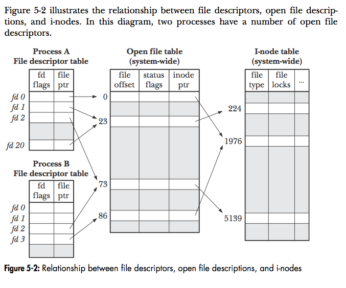

# fd

### Problem
```
Mommy! what is a file descriptor in Linux?

* try to play the wargame your self but if you are ABSOLUTE beginner, follow this tutorial link:
https://youtu.be/971eZhMHQQw

ssh fd@pwnable.kr -p2222 (pw:guest)
```

### Background Knowledge
* [What is a File Descriptor?](https://www.computerhope.com/jargon/f/file-descriptor.htm)
	- A **non-negative integer** number that **uniquely identifies** an open file in a computer's operating system.
	- This describes a data resource, and how that resource may be accessed.

| Name | File descriptor | Description |
|:----:|:---------------:|:------------|
| stdin | 0 | input. |
| stdout | 1 | output. |
| stderr | 2 | error. |

### Inspection
```
fd@ubuntu:~$ ls -l
total 16
-r-sr-x--- 1 fd_pwn fd   7322 Jun 11  2014 fd
-rw-r--r-- 1 root   root  418 Jun 11  2014 fd.c
-r--r----- 1 fd_pwn root   50 Jun 11  2014 flag
```
* ssh 접속 후 `ls -l` 실행 결과이다. `flag` 파일을 현재 계정인 `fd`로 직접 읽을 수 없도록 퍼미션이 설정되어있다.

```c
#include <stdio.h>
#include <stdlib.h>
#include <string.h>
char buf[32];
int main(int argc, char* argv[], char* envp[]){
        if(argc<2){
                printf("pass argv[1] a number\n");
                return 0;
        }
        int fd = atoi( argv[1] ) - 0x1234;
        int len = 0;
        len = read(fd, buf, 32);
        if(!strcmp("LETMEWIN\n", buf)){
                printf("good job :)\n");
                system("/bin/cat flag");
                exit(0);
        }
        printf("learn about Linux file IO\n");
        return 0;

}
```
* [`fd.c`](./fd.c)
	- 인자 개수가 2개 이상이어야 한다. 
		+ 기본적으로 `./fd`만 하면 `argv[0]`이 채워지고 `argc`는 `1`이다.
		+ `./fd 1234`를 해야 `argv[1] == 1234`으로 채워지고 `argc`는 `2`이다.
	- 정수로 바뀐([atoi()](https://www.ibm.com/support/knowledgecenter/ko/ssw_ibm_i_73/rtref/itoi.htm)) 넘겨진 인자 값과 `0x1234`을 뺀 값이 `fd`가 된다.
		- `0x1234 == 4660`
		- 반드시 10진수 정수로 넘겨주어야 한다. `atoi()`가 10진수만 먹는다.
	- `fd`에서 `32 bytes`만큼 읽어온 것이 **`LETMEWIN\n`과 같다면 `flag`를 출력**해준다.

### Solution
* `./fd 4660` 또는 `./fd 4661` 또는 `./fd 4662`를 실행한다.
	* 각각 `fd == 0`, `fd == 1`, `fd == 2`가 된다.
	* 이는 각각 `stdin`, `stdout`, `stderr`가 된다.
* `LETMEWIN`을 입력하고 Enter키를 먹인다.
	- `LETMEWIN\n`이 입력된다.
* `flag`을 뱉는다.

### Review
* 알게 된 것.
	- Linux의 File descriptor는 열린 파일을 고유하게 구분할 수 있는 음수가 아닌 정수 숫자임을 알 수 있었다.
	- 각각 `stdin`, `stdout`, `stderr`의 `fd`값과 용도를 알 수 있었다.
* 궁금한 것.
	- 원래 `open()`을 이용해서 `fd`값을 얻고 관련 작업을 진행하는 것으로 알고 있었다. 그냥 `fd`값만 알 수 있다면 `open()` 은 전혀 필요없는 것인가?
		+ Link about `open()` [Link 1](https://linux.die.net/man/3/open), [Link 2](http://man7.org/linux/man-pages/man2/open.2.html)
		+ The `open()` function shall return a file descriptor for the named file that is the lowest file descriptor **not currently open for that process**.
		+ 이미 `stdin`, `stdout`, `stderr`가 실행된 프로세스에서 열려있기에 가능했던 것 같다.
		+ 특정 프로세스에서 특정 파일을 `open()` 등의 함수로 불러들여 `fd`값을 할당했다면, 당연히 `fd`값만 알면 파일 관련 작업을 진행할 수 있다.
		+ 하지만 `open()`등의 함수로 불러들이는 작업을 하지 않았다면, 당연히 `fd` 값도 할당이 되어 있지 않을 것이고, 파일 관련 작업을 진행할 수 없다는 것이다.
		+ 
		+ 위 그림에 나타난 관계를 생성하는 작업을 `open()` 등의 함수가 하는 것이다.
	- `stdin`, `stdout`, `stderr`가 항상 모든 프로그램에서 쓸 수 있다면, **왜** 해당 `fd`값에서 `read()`로 읽어오면 Solution의 2번째 과정처럼 입력을 넣어줄 수 있게 되는지 잘 모르겠다. 그냥 버퍼에 남아있는 값들을 읽어오지 않고 왜 굳이 입력을 넣어줄 수 있게 되는 것인가?
		+ [C How read() function read from STDERR?](https://stackoverflow.com/questions/48443136/c-how-read-function-read-from-stderr)
		+ Q. In the terminal **it prompts me to type the input like it does with Stdin**. Why is that?
		+ A1. Because when you run the program directly from command-line, **both its stdin and stderr are connected to the same file (your terminal) that it has read access to**.
		+ A2. On success, **the open() system call returns the lowest available file descriptor**. After closing file descriptor 0, **the subsequent open opens file descriptor 0 (standard input)**, and the terminal is opened for read and write. Then file descriptors 1 (standard output) and 2 (standard error) are **duplicated from the read/write descriptor 0**. Thus, all three standard file descriptors are, by default, open for both reading and writing. Note the use of the term 'file descriptors'!